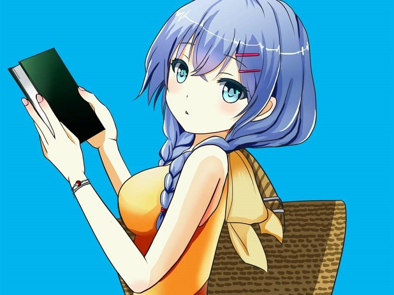
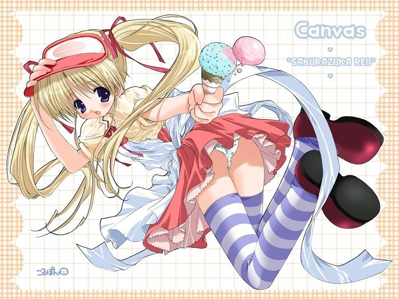

# Carousel-figure
​	本篇博文实现的是一个原生js写的轮播图,含括了大部分轮播图的功能,有的同学问前端框架那么多干嘛要用原生写,伤神费脑.

​	个人感觉程序世界里的框架,是让大牛更牛,小白也永远只是小白.框架是死的,需求是不断更新的,我们只有知道了原理,才能不断利用原理满足别人的需求,总会有那么个时候框架满足不了的.所以,不要依赖框架,为了不让自己一直做小白,最近一直在用原生js写bootstrap的一些效果.(刚入坑不久,大佬轻喷)

​	由于轮播图在网站中的应用比比皆是,在此分享和总结之前原生js实现的轮播图.

注:文中代码只是片段,具体可在[CSDN](https://download.csdn.net/download/qq_16756237/10514715)下载或者去我的GitHub仓库下载,记得给star哦,3q~

------

​	首先我们需要了解轮播图一些基本原理,和轮播图的一些功能:

#### **轮播图原理:**

> 并排的一组照片,放在父盒子的框里,父盒子overflow设置隐藏;


- 轮播图必须注意的一个问题:

> ​	第一张跳最后一张或者相反的时候,怎么解决中间的空窗期(不处理会很难看)?

#### **轮播图功能:**

> **自轮播**:用于展示,固定时间间隔自动跳下一张;
>
> **两翼轮播**:用于用户点击两侧的箭头,跳向前后一张;
>
> **点选**:通常位于下方用于标识当前所在张,也有点击跳向对应张的功能

无外乎,大多数轮播图也就这些功能,接下来我们就一一实现这些功能

**1 ) HTML视图:**

注意container里的img,需要在首尾各多加一张:

原理:以末尾跳向第一张为例,

当我们在最后一张时候点击下一张,视图显示最后一张的我们额外加的一张,也就是第一张的替代,此时显示的是第一张图片,确实不是真正位置的第一张,同时,在跳向这假第一张的时候将开始位置重置.

大家可以结合后面js代码理解.

```html
<div id="container">
    <!-- 图片 -->
        <div id="list" style="left: -800px;">
            
            
            
            
            
            
            
        </div>
        <div id="buttons">  <!-- 点选小圈圈 -->
            <span index="1" class="on"></span>
            <span index="2"></span>
            <span index="3"></span>
            <span index="4"></span>
            <span index="5"></span>
        </div>
    <!-- 上一张下一张 -->
        <a href="javascript:;" id="prev" class="arrow">&lt;</a>
        <a href="javascript:;" id="next" class="arrow">&gt;</a>
    </div>
```

**2 ) CSS样式:(片段)**

帮助大家理解下面样式,在此概述一下:

- 点选圆圈,当前张所对应的圈高亮显示;
- 两翼,鼠标滑过才显示,鼠标放上去高亮显示;
- 层级问题:除了父级的展示框盒子,上面是图片层,最上面是两翼和点选圈.

```css
 #container {
            position: relative;
            width: 800px;
            height: 600px;
            border: 3px solid black;
            overflow: hidden;
        }
 #buttons{
            position: absolute;
            left: 320px;
            bottom: 25px;
            width: 160px;
            height: 10px; 
            z-index: 6;
        }

#buttons span{
            float: left;
            margin: 0 10px;
            border: 1px solid #fff;
            width: 10px;
            height: 10px;
            border-radius: 50%;
            background: #333;
            cursor: pointer;
        }

.arrow{
            position: absolute;
            top: 260px;
            z-index: 2;
            width: 40px;
            height: 50px;
            font-size: 40px;
            font-weight: bold;
            line-height: 48px;
            text-align: center;
            color:#fff;
            background-color: rgb(0,0,0,0.3);
            cursor: pointer;
        }

 #container:hover .arrow {
            display: block;
        }
```

**3 ) js代码:**

- 关于动画,只有跳下一张上一张,无外乎就方向不一样,我们封装到一个函数,方向传参控制;
- 定时器的间隔控制函数,停止轮播函数;
- 小圆点的实现比较麻烦,我们循环给每个圆加事件,通过属性标签index获取用户点击的标签,用的是getAttribute();
- 还有具体地看代码注释吧,注释的比较详细.

```js
 function animate(offset) {
                //获取的是style.left，是相对左边获取距离，所以第一张图后style.left都为负值，
                //且style.left获取的是字符串，需要用parseInt()取整转化为数字。
                var newLeft = parseInt(list.style.left) + offset;
                list.style.left = newLeft + 'px';
                //无限滚动判断
                if (newLeft > -600) {
                    list.style.left = -3000 + 'px';
                }
                if (newLeft < -3000) {
                    list.style.left = -600 + 'px';
                }
            }
function buttonsShow() {
                // //将之前的小圆点的样式清除
                for (var i = 0; i < buttons.length; i++) {
                    if (buttons[i].className == "on") {
                        buttons[i].className = "";
                    }
                }
                //数组从0开始，故index需要减1
                buttons[index - 1].className = "on";
                console.log(index-1);
            }
 for (var i = 0; i < buttons.length; i++) {
               
                    buttons[i].onclick = function () {
                        /*  这里获得鼠标移动到小圆点的位置，用this把index绑定到对象buttons[i]上，去谷歌this的用法  */
                        /*  由于这里的index是自定义属性，需要用到getAttribute()这个DOM2级方法，去获取自定义index的属性*/
                        var clickIndex = parseInt(this.getAttribute('index'));//this指向当前点击圈
                        var offset = 600 * (index - clickIndex); //这个index是当前图片停留时的index
                        index = clickIndex; //存放鼠标点击后的位置，用于小圆点的正常显示
                        animate(offset);
                        buttonsShow();
                    }
                
            }

            container.onmouseover = stop;
            container.onmouseout = play;
            play(); //初始化
```

